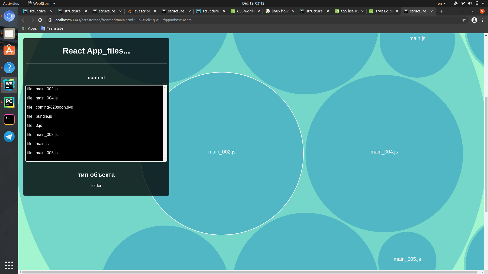

# dataStorage

## предисловие
тз показалось мне тухлым, так что я, выполнив его,  потихоньку
добавляю интересную (на мой взгляд) функциональность.

Я решил добавить гф. интерфейс для просмотра папки store в которой лежат тестовые данные (не чистите папку, тесты 
сломаются). Показываю:

## запуск демона
1) активируем виртуальное окружение 
    
    <code>
        source ./venv/bin/activate 
    </code>
        
        

2) запустим демона
    
    <code>
        python ./dataStorage.py start 
   </code>
    
    
   по умолчанию сервер работает на http://127.0.0.1:8082
   
## команды демона
1) убить демона
    
    <code>
        python ./dataStorage.py stop 
   </code>

2) перезапустить демона

    <code>
        python ./dataStorage.py restart 
   </code>

## запустить End to End (E2E) тест сервера
<code>
    python -m unittest tests.TestServerE2E.test_E2E in ./datastorage
</code>

в тесте происходит 

- проверка загрузки файлов
- проверка скачивания файлов
- проверка удаления файлов

    